# claude-readout

Shows which files Claude Code read. The folded `Read 3 files` line names them instead, along with the lines it read and what it searched for.

<p align="center">
  
</p>

It answers [#21151](https://github.com/anthropics/claude-code/issues/21151). Verbose mode shows the names too, but it turns on more than names, and it doesn't reach VS Code. readout changes only the folded line, on every surface, at no token cost.

&nbsp;

## install

readout runs on function hooks, an early-access part of Claude Code. Turn them on in `~/.claude/settings.json`:

```json
{ "env": { "CLAUDE_CODE_ENABLE_FUNCTION_HOOKS": "1" } }
```

Then install it and start a new session:

```sh
claude plugin marketplace add lucenity0/claude-readout
claude plugin install readout@claude-readout
```

To hack on it instead, clone it and load the folder with `claude --plugin-dir ~/claude-readout`.

Function hooks may change between releases. readout was tested on Claude Code 2.1.289.

&nbsp;

## what it shows

```
Read                 the path, relative to the project or under ~, and the lines: date.test.ts:1-60
Grep, Glob           the pattern, and where it looked
Bash                 the command, one row each, wrapping when long
WebFetch, WebSearch  the url or the query
```

Calls in a row to the same tool share a line. Files in one folder gather as `src/{a.ts, b.ts}`, a file read twice shows `×2`, and the call still running is dim until it lands. A line that runs past the window ends in `+N more`.

In terminals that draw links (iTerm2, Warp, Ghostty, WezTerm, kitty, VS Code), each path is a link: cmd-click it to open the file.

In the terminal, tool rows sit on a quiet band in softer text, so they stand apart from Claude's replies.

A call that failed is red, along with its reason. A call a plugin blocked says which one (`blocked by <plugin>`).

```
● Read  src/old.ts  File does not exist
```

`ctrl+o` and `--verbose` work as before.

&nbsp;

## settings

```json
{ "pluginConfigs": { "readout@claude-readout": { "options": { "mode": "inline", "links": "auto", "tint": "auto" } } } }
```

`mode` is `inline` (the default: one line per tool, as above) or `expand`, which unfolds every group into Claude Code's own row per call.

`links` is `auto`, `on` or `off`. A terminal that can't draw links prints each URL beside its name, so `auto` only turns them on in the terminals above.

`tint` is `auto` (a band to suit your light or dark theme), `off`, or a band color of your own such as `#1d2128`.

&nbsp;

## contributing

```sh
claude plugin validate .
claude plugin test .
```

The labels and layout live in [`format.ts`](hooks/format.ts) and the drawing in [`register.tsx`](hooks/register.tsx). The demo is drawn with `format.ts` too: `node --experimental-strip-types assets/demo.mts`.

&nbsp;

---

<sub>MIT · built with Claude Code</sub>
